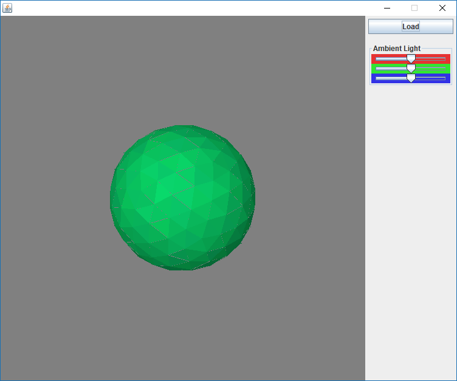

## 3D Renderer

### Purpose
Render 3d shapes as polygons loaded from a file. The goal of this assignment is to write a program that implements a simple but complete pipeline for rendering 3D shapes represented by polygons. Given a file with a format number of polygons, lines with RGB values, followed by floats representing the x,y,z values for 3 different points. Finally the file includes a light source vector.

### The program
+ The program reads the file for all polygons and light source.
+ The program computes the normal and the light intensity of every non-hidden polygon
+ Finds the edge lists of all polygons
+ Renders the image as an array of colors using a Z-Buffer
+ Displays the colors based on reflection, ambient light, incident light and direction.
+ Rotating the shape is constantly set to the centre of the window and scaled when rotated.