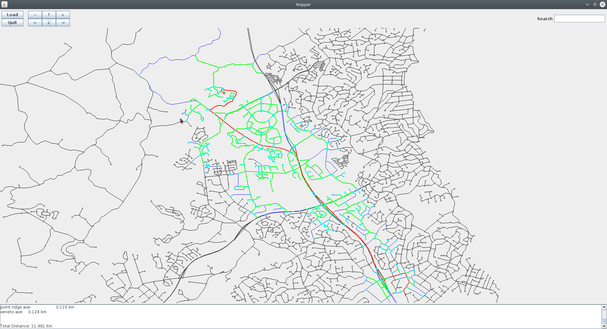
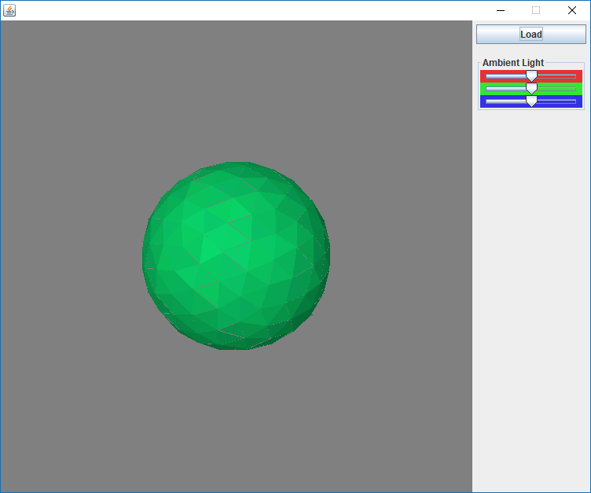
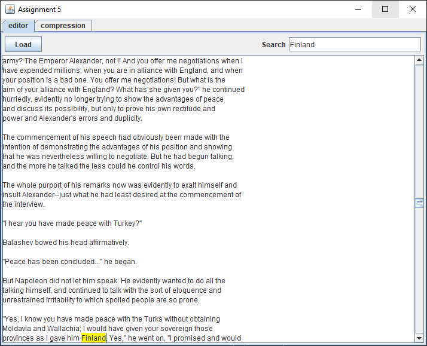

# COMP 261 - Algorithms and Datastructures
https://www.victoria.ac.nz/courses/comp/261/2019/offering?crn=18314

## Note
This document covers projects and assignments made while studying COMP 261 - Algorithms and Datastructures. 

The source files are unable to be published to the public to help ensure academic integrity and due to copyright concerns involved with the assignment scaffolding.

# Assignments 

## Auckland Road System

### Purpose - Create a map of the Auckland road system, implement pathfinding and identifying non redundant intersections

### Features
+ Reads tab seperated data files to import the roads
+ Displays the map with zoom, panning
+ Able to highlight a road when searching for the road by name
+ Implements a Trie structure for fast road name searches
+ Looks up connected roads by clicking on an intersection
+ Performs A* search with a heuristic that can be easily modified. Currently has a heuristic that is based on distance, with a modifier that can allow for more/less exploration
+ Paths are output in the nice format in text and highlighted on the map
+ Displays explored paths for easy debugging or modification of heuristic
+ Articulation points are discovered and highlighted when loading a map
+ The Pathfinding heuristic has a boolean for time/distance and a set of buttons for changing between time and distance

## 3D Renderer

### Purpose
Render 3d shapes as polygons loaded from a file. The goal of this assignment is to write a program that implements a simple but complete pipeline for rendering 3D shapes represented by polygons. Given a file with a format number of polygons, lines with RGB values, followed by floats representing the x,y,z values for 3 different points. Finally the file includes a light source vector.

### The program
+ The program reads the file for all polygons and light source.
+ The program computes the normal and the light intensity of every non-hidden polygon
+ Finds the edge lists of all polygons
+ Renders the image as an array of colors using a Z-Buffer
+ Displays the colors based on reflection, ambient light, incident light and direction.
+ Rotating the shape is constantly set to the centre of the window and scaled when rotated.

## Search and Compression

### Purpose
+ Implement the Knuth Morris Pratt algorithm and compare performance to the brute force/naive method. 
+ Implement Huffman and Lempel Ziv  compression

### The program
+ The program is able to perform KMP search and compare the number of operations between it and the naive method 
+ The program implements Huffman Coding compression/decompression
+ The program implements Lempel Ziv compression/decompression
