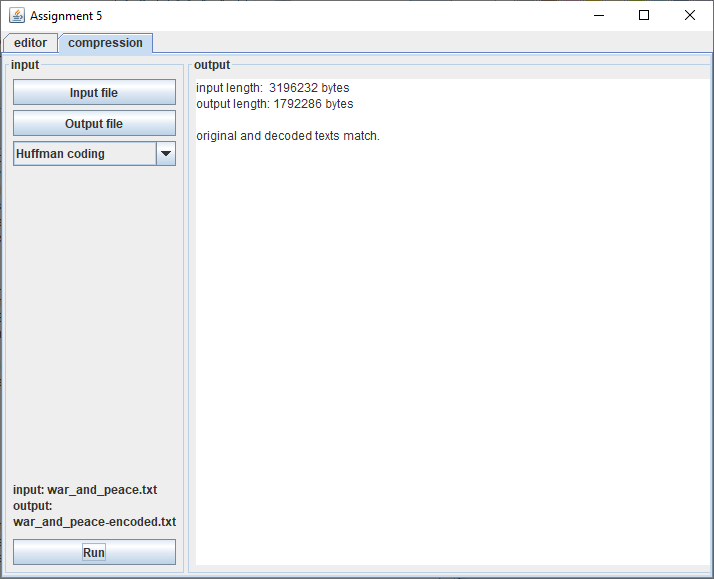

## Search and Compression

### Purpose
+ Implement the Knuth Morris Pratt algorithm and compare performance to the brute force/naive method. 
+ Implement Huffman and Lempel Ziv  compression

### The program
+ The program is able to perform KMP search and compare the number of operations between it and the naive method 
+ The program implements Huffman Coding compression/decompression
+ The program implements Lempel Ziv compression/decompression
